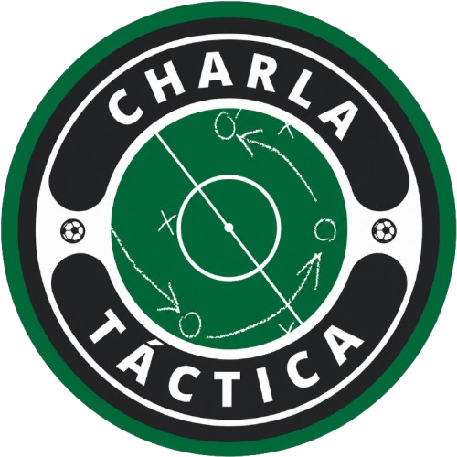
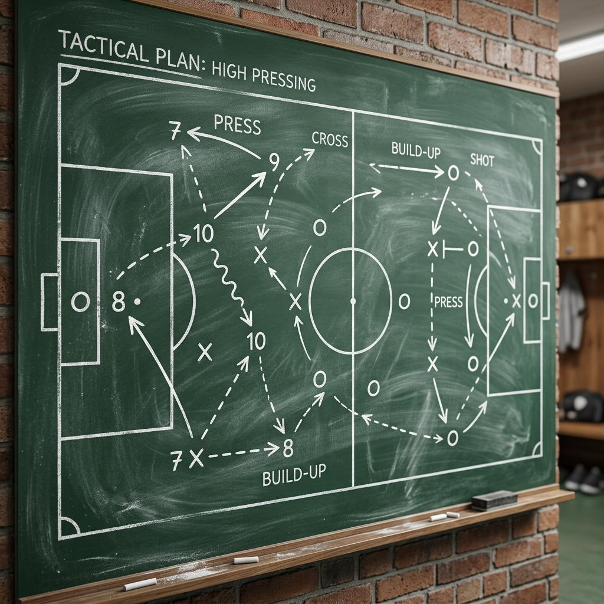
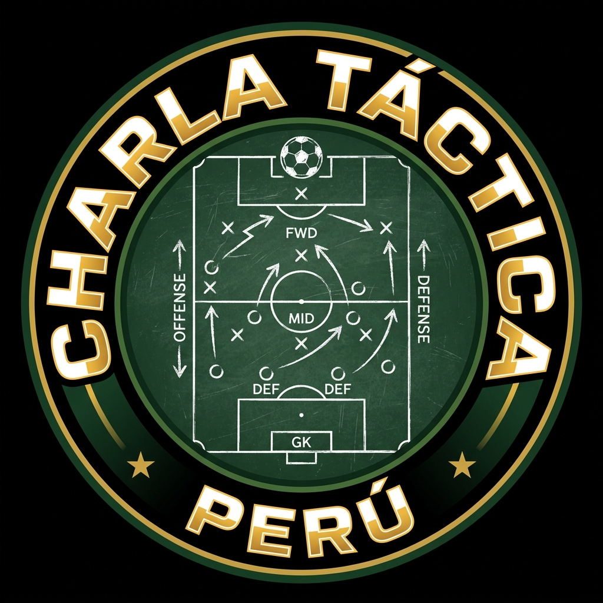
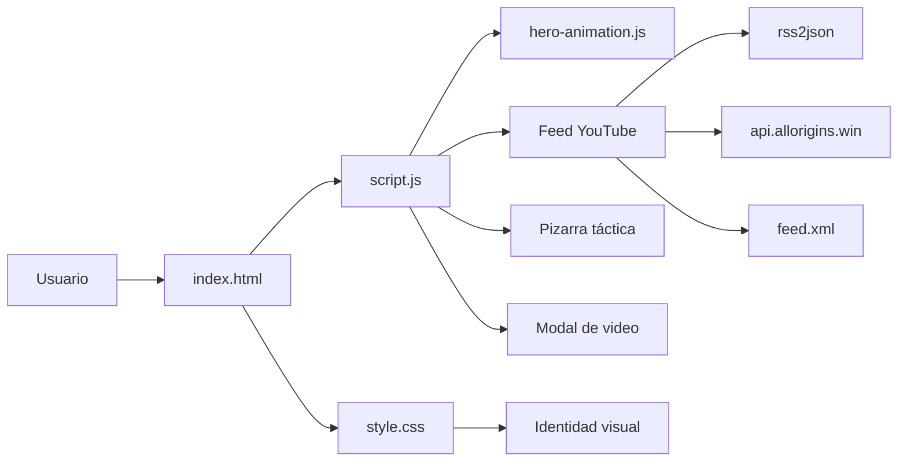

# Charla Táctica Perú

<p align="center">
  
</p>

<p align="center">
  <strong>Análisis crema, debate táctico y actualidad del fútbol peruano</strong>
</p>

<p align="center">
  
</p>

<p align="center">
  
  
  
  
  
</p>

---

## Portada Visual

<table>
  <tr>
    <td align="center">
      
      <br>
      <sub>Identidad visual principal</sub>
    </td>
    <td align="center">
      
      <br>
      <sub>Panelistas y comunidad</sub>
    </td>
    <td align="center">
      
      <br>
      <sub>Contenido y debate</sub>
    </td>
  </tr>
</table>

---

## Qué Es

**Charla Táctica Perú** es un sitio web oficial e interactivo para analizar, debatir y seguir la actualidad de **Universitario de Deportes**, la **Liga 1** y la **selección peruana**.

El proyecto combina una estética tipo pizarra con un sistema moderno de contenido dinámico, videos de YouTube y una pizarra táctica funcional para explorar formaciones y jugadas.

### Lo que destaca

* `Pizarra táctica interactiva` con formaciones y arrastre de jugadores.
* `Feed de YouTube` con carga dinámica y fallback offline.
* `Animaciones premium` para una entrada visual más cinematográfica.
* `Diseño responsive` pensado para móvil y escritorio.

---

## Diagrama



---

## Características Principales

### ⚽ Pizarra Táctica
* Formaciones dinámicas: `3-5-2`, `4-3-3` y `4-2-3-1`.
* Drag & drop compatible con mouse y táctil.
* Flechas y líneas SVG que se recalculan según la pantalla.

### 📺 Videos y Transmisiones
* Consumo directo del canal de YouTube.
* Estrategia dual de fallback para mantener contenido disponible.
* Tarjetas con badges automáticos como `Previa`, `Debate` y `Post Partido`.

### 🎬 Animaciones
* Revelado secuencial del título.
* Efectos de entrada para la pizarra y nodos.
* Protección contra FOUC para que el hero cargue limpio.

### 🎨 Diseño
* Fondo tipo pizarra con estilo deportivo.
* Paleta oscura con acentos crema y verde táctico.
* Componentes pensados para lectura clara y sensación premium.

---

## Arquitectura

```text
CHARLATACTICA/
├── img/
│   ├── logo.png
│   ├── LOGO1.png
│   ├── chalkboard_bg.png
│   ├── DiegoCervan.jpg
│   ├── EduardoBuitron.jpg
│   └── juliodefeudis.jpg
├── index.html
├── style.css
├── script.js
├── hero-animation.js
├── feed.xml
├── yt.html
└── README.md
```

---

## Tecnologías

* HTML5
* CSS3
* JavaScript ES6+
* Motion
* SVG
* Fetch API

---

## Ejecución Local

1. Abre el proyecto en una carpeta local.
2. Levanta un servidor estático, por ejemplo:

```bash
python -m http.server 8000
```

3. Abre `http://localhost:8000`.

---

## Canal de YouTube

Si deseas cambiar el canal, edita la constante `channelId` en [`script.js`](script.js).

---

## Descargo

Este sitio y la comunidad de **Charla Táctica Perú** son un proyecto independiente de análisis futbolístico. No tienen afiliación oficial, patrocinio ni representación formal de **Universitario de Deportes**.
